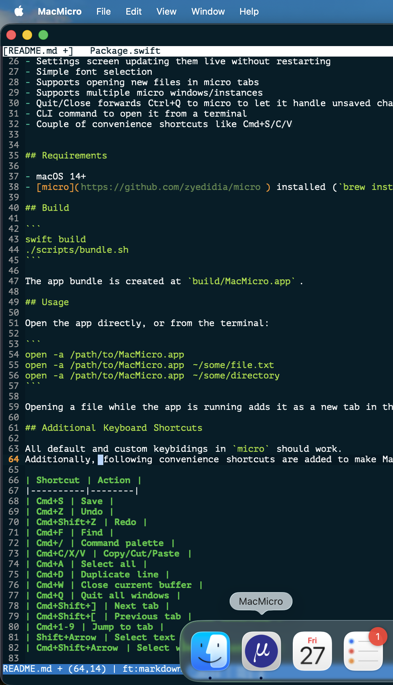

# MacMicro

A native macOS app wrapping the [micro](https://micro-editor.github.io/) terminal editor.

<p align="center">
  
</p>

Note: I shamelessly used official Micro logo just for illustrative purposes, may need different going forward.

## Why?

I was looking for a new, simpler replacement for Sublime Text. Two particular features I wanted to keep are:

- command palette (extendable)
- multicursor

I knew micro has those features, but for a long time I didn't consider it for my MacOS workstation as the editor should be a standalone app rather than many of terminal commands.

With a little help of LLM-based coding agent I was able to prototype this wrapper.

The current status is **ready for testing**, I used it already as my daily driver.
If this proves to be helpful prototype I will refine and if needed rehaul the codebase.


## Features

- Native Swift app based on [SwiftTerm](https://github.com/migueldeicaza/SwiftTerm)
- Works with Finder, opening files, can register as default editor
- Uses unmodified micro binary (needs to be installed separately)
- Minimal UI that adapts to micro color scheme
- Settings screen updating them live without restarting
- Simple font selection
- Supports opening new files in micro tabs
- Supports multiple micro windows/instances
- Quit/Close forwards Ctrl+Q to micro to let it handle unsaved changes (app waits until user makes decision)
- CLI command to open it from a terminal
- Couple of convenience shortcuts like Cmd+S/C/V


## Requirements

- macOS 14+
- [micro](https://github.com/zyedidia/micro) installed (`brew install micro`)

## Build

```
swift build
./scripts/bundle.sh
```

The app bundle is created at `build/MacMicro.app`.

## Usage

Open the app directly, or from the terminal:

```
open -a /path/to/MacMicro.app
open -a /path/to/MacMicro.app ~/some/file.txt
open -a /path/to/MacMicro.app ~/some/directory
```

Opening a file while the app is running adds it as a new tab in the active micro instance.

## Additional Keyboard Shortcuts

All default and custom keybidings in `micro` should work.
Additionally, following convenience shortcuts are added to make MacMicro feel like native Mac editor:

| Shortcut | Action |
|----------|--------|
| Cmd+S | Save |
| Cmd+Z | Undo |
| Cmd+Shift+Z | Redo |
| Cmd+F | Find |
| Cmd+/ | Command palette |
| Cmd+C/X/V | Copy/Cut/Paste |
| Cmd+A | Select all |
| Cmd+D | Duplicate line |
| Cmd+W | Close current buffer |
| Cmd+Q | Quit all windows |
| Cmd+Shift+] | Next tab |
| Cmd+Shift+[ | Previous tab |
| Cmd+1-9 | Jump to tab |
| Shift+Arrow | Select text |
| Cmd+Shift+Arrow | Select word/to start/end |

All of micro's own keybindings also work.

## Settings

`Cmd+,` opens a native preferences window. Changes are applied live to the running micro instance.

Configuration is stored in `~/Library/Application Support/MacMicro/micro/`, separate from standalone micro's config.

## Architecture

MacMicro embeds micro in a [SwiftTerm](https://github.com/migueldeicaza/SwiftTerm) terminal view. A bundled micro plugin (`macmicro.lua`) provides an IPC channel for reliable communication between the native app and the editor — used for opening files, changing settings, and tab navigation.


## Logo

For this proof of concept I used logo directly from [micro project](https://github.com/zyedidia/micro).
I'm happy to replace it with custom one, but I just wanted to make it clear this is not a fork or alternative. This is micro editor in MacOS app shell.

## License

MIT
